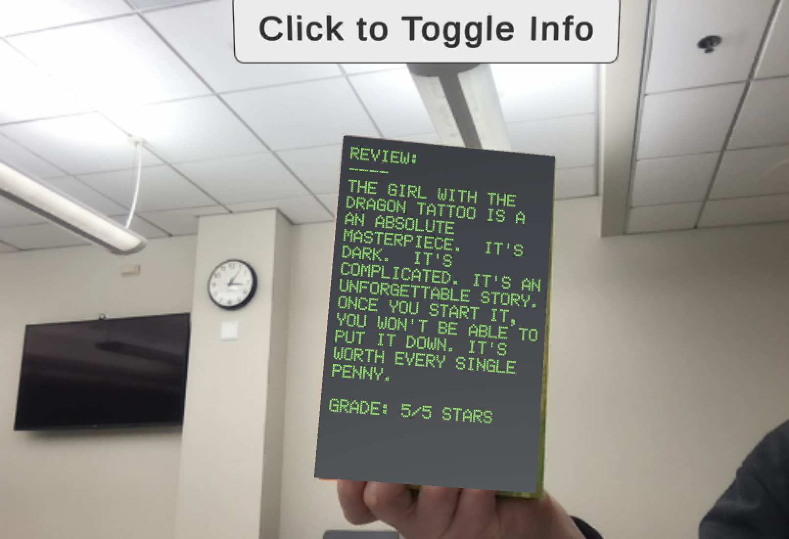

# AR Book Cover
An augmented reality book cover for *The Girl with the Dragon Tattoo* by Stieg Larson. The front cover augments a 3D dragon that is shooting fire, and the back cover toggles between misc. book information and a personal book review. 

- An iOS demo is located at: `Deliverables/iOS_arBookCoverDemo.mp4.zip`
- A unity demo is located at: `Deliverables/arBookCoverDemo.zip`

## Description of Code
This project was made using Unity and Vuforia for an iOS > 12.0 build. The Unity code is too large to push to GitHub, but if interested, I can send your way. Code elements of note:
- **Scene objects** are located in `TheDragonTattoo > Assets > Scenes > BookScene`
- **Animations** are located in `TheDragonTattoo > Assets > Animations`
- The **script** used for the button event is `TheDragonTattoo > Assets > toggle`

**Note:** The BookScene would be the best place to start for customizations.

## Code Limitations
Device:
This code is meant for an iOS device > 12.0. In order to initially build to an iPhone, any computer with XCode installed is also necessary.

Product:
The arBookCover App will only augment to *The Girl with the Dragon Tattoo* covers that match the versions used as image targets in this project. Any other editions or covers will not register as an image target for the App.

## How to Run
**Note:** The build file is too large to push to GitHub. If interested in building on your own iOS device, email me at the contact info below.

Directions to build (requires XCode):
1. Clone this repository with:
    > git clone https://github.com/pkrobinette/arBookCover
2. Navigate to the arBookCover directory
3. Decompress the iOS_Build folder and go into the folder
4. Double-click on the `Unity-iPhone.xcodeproj` file. This will open the file in XCode.
5. Click the top `Unity-iPhone` directory on the left side of the screen.
6. Navigate to `Signing and Capabilities`
7. Click `Automatically manage signing`
8. For team, select your developer team
9. Plug-in your iOS device > 12.0
10. On the top bar, select your iPhone's name. This is where the app will build to.
11. Click the triangle icon for play on the top left of the GUI. The app will now start installing.
12. Wait until everything is successfully built, and wallah, the app should now be on your iPhone. Enjoy!

## Front Cover

## Back Cover

   
  

  
 ### Contact info
 (dot) = .
 
 (at) = @
 
 **email:** preston(dot)k(dot)robinette(at)vanderbilt(dot)edu
